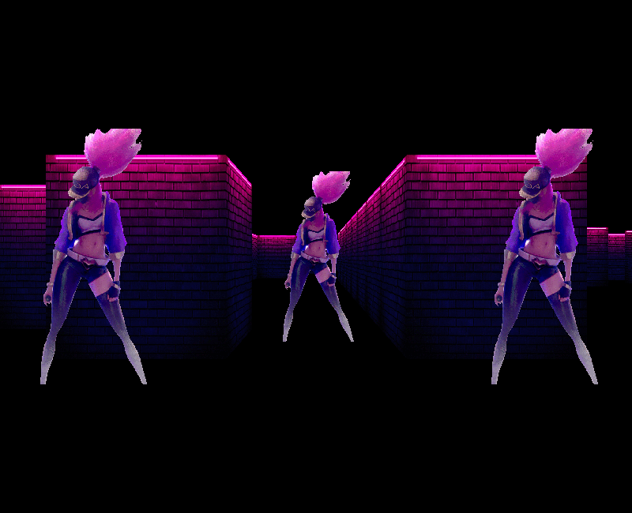

# CUB-3D

a “realistic” 3D graphical
representation of the inside of a maze from a
first person perspective
(like [Wolfenstein 3D](https://fr.wikipedia.org/wiki/Wolfenstein_3D)).

### How to run it

Use ``make`` to generate the ``cub3D`` executable.
You can launch it with ``./cub3D map.cub``.

### Controls

You can move around the maze with ``W`` ``A`` ``S`` ``D``.
You can also rotate the view with the directional arrows ``←`` and ``→``.
You can increase the move speed with ``SHIFT``.
To exit the game, press ``ESC`` or click the red cross.

## Resources

* [Tutorial](https://lodev.org/cgtutor/raycasting.html)
* [Wolfenstein 3D](http://users.atw.hu/wolf3d/)
* [X11](https://github.com/qst0/ft_libgfx)
* [BMP format](https://web.archive.org/web/20080912171714/http://www.fortunecity.com/skyscraper/windows/364/bmpffrmt.html)
